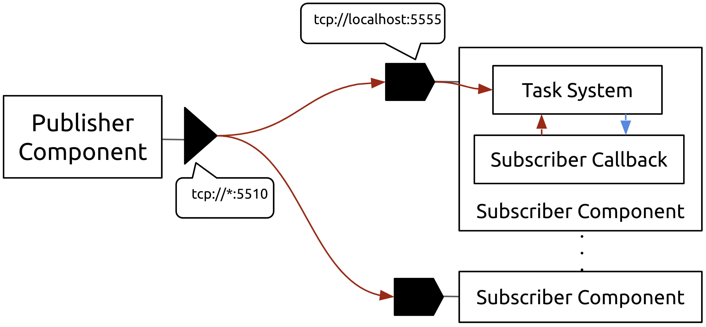

<p align="center">
    
</p>

`iris` is a `C++17` header-only library that provides a [component model](https://en.wikipedia.org/wiki/Component-based_software_engineering) and messaging framework based on [ZeroMQ](https://zeromq.org/). 

## Component Model

An `iris::Component` is a building block - A reusable piece of software that can be instantiated and connected with other components. Think LEGO. Large and complex software systems can be assembled by composing small, tested component building blocks. 

`iris` components support:

* A variety of communication ports and patterns: _Publisher_, _Subscriber_, _Client_, _Server_, _AsyncServer_, and _Brokers_
* Periodic and oneshot timers that can trigger the component into action
* A speedy multi-threaded task system with task stealing
* [Cereal](https://github.com/USCiLab/cereal)-based serialization and deserialization of complex structures
* [ZeroMQ](https://zeromq.org/)-based messaging

<p align="center">
    
</p> 

## Getting Started

Simply include `#include <iris/iris.hpp>` and you're good to go. Start by creating an `iris::Component`:

```cpp
iris::Component my_component;
```

You can optionally specify the number of threads the component can use in its task system, e.g., this component will spawn 2 executor threads that process records in its respective message queues. 

```cpp
iris::Component my_component(iris::threads = 2);
```

**NOTE:** Here `iris::threads` is a [NamedType](https://github.com/joboccara/NamedType) parameter. It is not necessary to use named parameters but in certain cases they improve code readability.

## Time-Triggered Operations

`iris` components can be triggered periodically by timers. To create a timer, call `component.set_interval`. The following component is triggered every 500ms. Timers are an excellent way to kickstart a communication pattern, e.g., publish messages periodically to multiple sinks.

Call `Component.start()` to start the component - This starts the component executor threads, listener threads, timers etc.

```cpp
#include <iostream>
#include <iris/iris.hpp>
using namespace iris;

int main() {
  Component my_component;
  my_component.set_interval(period = 500,
                            on_triggered = [] { std::cout << "Timer fired!\n"; });
  my_component.start();
}
```

### One-shot Timers

Use `component.set_timeout` to create a one-shit timer that triggers the component after a set delay. 

```cpp
// oneshot_timers.cpp
#include <iris/iris.hpp>
using namespace iris;
#include <iostream>

int main() {
  Component c;
  c.set_timeout(delay = 1000,
                on_triggered = [] { std::cout << "1.0 second Timeout!" << std::endl; 
                });
  c.set_timeout(delay = 2500,
                on_triggered = [] { std::cout << "2.5 second Timeout!" << std::endl; 
                });
  c.set_timeout(delay = 5000, 
                on_triggered = [&] {
                    std::cout << "Stopping component" << std::endl;
                    c.stop();
                });
  c.start();
}
```

Noice that the component is stopped after 5 seconds - `component.stop()` stops the task scheduler from further processing of tasks. 

## Publish-Subscribe Interactions

Publish/Subscribe is classic pattern where senders of messages, called publishers, do not program the messages to be sent directly to specific receivers, called subscribers. Messages are published without the knowledge of what or if any subscriber of that knowledge exists.

<p align="center">
    
</p>

In this example ([samples/nginx_log_publisher](https://github.com/p-ranav/iris/tree/master/samples/nginx_log_publisher)), we will be parsing an Nginx log file and publishing each log entry. Here's the log file format:

```bash
[{"time": "17/May/2015:08:05:32 +0000", "remote_ip": "93.180.71.3", "remote_user": "-", "request": "GET /downloads/product_1 HTTP/1.1", "response": 304, "bytes": 0, "referrer": "-", "agent": "Debian APT-HTTP/1.3 (0.8.16~exp12ubuntu10.21)"},
{"time": "17/May/2015:08:05:23 +0000", "remote_ip": "93.180.71.3", "remote_user": "-", "request": "GET /downloads/product_1 HTTP/1.1", "response": 304, "bytes": 0, "referrer": "-", "agent": "Debian APT-HTTP/1.3 (0.8.16~exp12ubuntu10.21)"},
{"time": "17/May/2015:08:05:24 +0000", "remote_ip": "80.91.33.133", "remote_user": "-", "request": "GET /downloads/product_1 HTTP/1.1", "response": 304, "bytes": 0, "referrer": "-", "agent": "Debian APT-HTTP/1.3 (0.8.16~exp12ubuntu10.17)"},
{"time": "17/May/2015:08:05:34 +0000", "remote_ip": "217.168.17.5", "remote_user": "-", "request": "GET /downloads/product_1 HTTP/1.1", "response": 200, "bytes": 490, "referrer": "-", "agent": "Debian APT-HTTP/1.3 (0.8.10.3)"},
{"time": "17/May/2015:08:05:09 +0000", "remote_ip": "217.168.17.5", "remote_user": "-", "request": "GET /downloads/product_2 HTTP/1.1", "response": 200, "bytes": 490, "referrer": "-", "agent": "Debian APT-HTTP/1.3 (0.8.10.3)"},
{"time": "17/May/2015:08:05:57 +0000", "remote_ip": "93.180.71.3", "remote_user": "-", "request": "GET /downloads/product_1 HTTP/1.1", "response": 304, "bytes": 0, "referrer": "-", "agent": "Debian APT-HTTP/1.3 (0.8.16~exp12ubuntu10.21)"},
{"time": "17/May/2015:08:05:02 +0000", "remote_ip": "217.168.17.5", "remote_user": "-", "request": "GET /downloads/product_2 HTTP/1.1", "response": 404, "bytes": 337, "referrer": "-", "agent": "Debian APT-HTTP/1.3 (0.8.10.3)"},
{"time": "17/May/2015:08:05:42 +0000", "remote_ip": "217.168.17.5", "remote_user": "-", "request": "GET /downloads/product_1 HTTP/1.1", "response": 404, "bytes": 332, "referrer": "-", "agent": "Debian APT-HTTP/1.3 (0.8.10.3)"},
{"time": "17/May/2015:08:05:01 +0000", "remote_ip": "80.91.33.133", "remote_user": "-", "request": "GET /downloads/product_1 HTTP/1.1", "response": 304, "bytes": 0, "referrer": "-", "agent": "Debian APT-HTTP/1.3 (0.8.16~exp12ubuntu10.17)"},
{"time": "17/May/2015:08:05:27 +0000", "remote_ip": "93.180.71.3", "remote_user": "-", "request": "GET /downloads/product_1 HTTP/1.1", "response": 304, "bytes": 0, "referrer": "-", "agent": "Debian APT-HTTP/1.3 (0.8.16~exp12ubuntu10.21)"},
{"time": "17/May/2015:08:05:12 +0000", "remote_ip": "217.168.17.5", "remote_user": "-", "request": "GET /downloads/product_2 HTTP/1.1", "response": 200, "bytes": 3316, "referrer": "-", "agent": "-"},
{"time": "17/May/2015:08:05:49 +0000", "remote_ip": "188.138.60.101", "remote_user": "-", "request": "GET /downloads/product_2 HTTP/1.1", "response": 304, "bytes": 0, "referrer": "-", "agent": "Debian APT-HTTP/1.3 (0.9.7.9)"},
{"time": "17/May/2015:08:05:14 +0000", "remote_ip": "80.91.33.133", "remote_user": "-", "request": "GET /downloads/product_1 HTTP/1.1", "response": 304, "bytes": 0, "referrer": "-", "agent": "Debian APT-HTTP/1.3 (0.8.16~exp12ubuntu10.16)"},
{"time": "17/May/2015:08:05:45 +0000", "remote_ip": "46.4.66.76", "remote_user": "-", "request": "GET /downloads/product_1 HTTP/1.1", "response": 404, "bytes": 318, "referrer": "-", "agent": "Debian APT-HTTP/1.3 (1.0.1ubuntu2)"},
{"time": "17/May/2015:08:05:26 +0000", "remote_ip": "93.180.71.3", "remote_user": "-", "request": "GET /downloads/product_1 HTTP/1.1", "response": 404, "bytes": 324, "referrer": "-", "agent": "Debian APT-HTTP/1.3 (0.8.16~exp12ubuntu10.21)"},
{"time": "17/May/2015:08:05:22 +0000", "remote_ip": "91.234.194.89", "remote_user": "-", "request": "GET /downloads/product_2 HTTP/1.1", "response": 304, "bytes": 0, "referrer": "-", "agent": "Debian APT-HTTP/1.3 (0.9.7.9)"},
{"time": "17/May/2015:08:05:07 +0000", "remote_ip": "80.91.33.133", "remote_user": "-", "request": "GET /downloads/product_1 HTTP/1.1", "response": 304, "bytes": 0, "referrer": "-", "agent": "Debian APT-HTTP/1.3 (0.8.16~exp12ubuntu10.17)"},
{"time": "17/May/2015:08:05:38 +0000", "remote_ip": "37.26.93.214", "remote_user": "-", "request": "GET /downloads/product_2 HTTP/1.1", "response": 404, "bytes": 319, "referrer": "-", "agent": "Go 1.1 package http"},
..
...
....
```

First we can write a message struct `NginxLogEntry`. `iris` uses [Cereal](https://github.com/USCiLab/cereal) for serialization and deserialization of messages for transport. Our `NginxLogEntry` struct has a `serialize` method for this purpose. 

```cpp
// nginx_log_entry.hpp
#pragma once
#include <string>

struct NginxLogEntry {
  std::string time;
  std::string remote_ip;
  std::string remote_user;
  std::string request;
  unsigned response;
  unsigned bytes;
  std::string agent;

  template <class Archive> void serialize(Archive &ar) {
    ar(time, remote_ip, remote_user, request, response, bytes, agent);
  }
};
```

We can start by writing our subscriber.

* Create a subscriber using `component.create_subscriber`
* The signature of a subscriber callback is `std::function<void(Message)>` 
* You can deserialize the received message using `Message.get<T>()`
* Here, we are receiving log entries and printing select fields

```cpp
// subscriber.cpp
#include <iostream>
#include <iris/iris.hpp>
using namespace iris;
#include "nginx_log_entry.hpp"

int main() {
  Component receiver(threads = 2);
  receiver.create_subscriber(
      endpoints = {"tcp://localhost:5555"}, 
      timeout = 5000,
      on_receive = [](Message msg) {
          auto entry = msg.get<NginxLogEntry>();
          std::cout << "[" << entry.time << "] "
                    << "{" << entry.remote_ip << "} "
                    << "-> " << entry.request
                    << "-> " << entry.response << std::endl;
      });
  receiver.start();
}
```

Now, for the publisher. When managing state, it is cleaner to inherit from `iris::Component` and write a class.

* Create a class named `NginxLogPublisher` that inherits from `iris::Component`
* Create a publisher by calling `create_publisher` - We have inherited this method
* Parse the JSON log file
* Create a periodic timer using `set_interval` and publish log messages
* Call `join()` on the class destructor to join on the task system executor threads

```cpp
// publisher
#include <iostream>
#include <iris/iris.hpp>
using namespace iris;
#include "nginx_log_entry.hpp"
#include "json.hpp"
#include <fstream>

class NginxLogPublisher : public Component {
  Publisher pub;
  nlohmann::json j;
  nlohmann::json::iterator it;

public:
  NginxLogPublisher(const std::string &filename) {
    // read a JSON file
    std::ifstream stream("nginx_logs.json");
    stream >> j;
    it = j.begin();

    // Craete publisher
    pub = create_publisher(endpoints = {"tcp://*:5555"});

    // Publish periodically
    set_interval(period = 200, 
                 on_triggered = [this] {
                     auto element = *it;
                     std::cout << "Published: " << element << std::endl;
                     pub.send(NginxLogEntry{
                         .time = element["time"].get<std::string>(),
                         .remote_ip = element["remote_ip"].get<std::string>(),
                         .remote_user = element["remote_user"].get<std::string>(),
                         .request = element["request"].get<std::string>(),
                         .response = element["response"].get<unsigned>(),
                         .bytes = element["bytes"].get<unsigned>(),
                         .agent = element["agent"].get<std::string>()
                     });
                     ++it;
                 });
  }

  ~NginxLogPublisher() {
    join();
  }

};

int main() {
  NginxLogPublisher publisher("nginx_logs.json");
  publisher.start();
}
```

<p align="center">
    
</p>

## Synchronous Request-Reply Interactions

The client-server model is one of the basic interaction patterns in `iris` - client sends a request and server replies to the request.

<p align="center">
    
</p>

Say we have a music database server that can be queried for album metadata. Clients can request for album metadata using a catalog ID. Servers will respond with the album metadata. 

Let's start with the server response - the `Album` struct. Note the use of cereal `serialize` method for serialization/deserialization.

```cpp
// album.hpp
#pragma once
#include <iris/cereal/types/vector.hpp>
#include <string>
#include <vector>

struct Album {
  std::string name;
  std::string artist;
  int year;
  std::string genre;
  std::vector<std::string> tracks;

  template <class Archive> void serialize(Archive &ar) {
    ar(name, artist, year, genre, tracks);
  }
};
```

To create a server port, call `component.create_server`. 

* Server callbacks have the signature `std::function<void(Request, Response&)>`
* Simply deserialize the request, perform the server task, and use `response.set()` to set the server response

```cpp
// server.cpp
#include "album.hpp"
#include <iris/iris.hpp>
using namespace iris;
#include <iostream>
#include <map>

int main() {

  // This is our "database"
  std::map<std::string, Album> albums;
  albums["R2 552927"] = Album{
      .name = "Paranoid",
      .artist = "Black Sabbath",
      .year = 1970,
      .genre = "Heavy metal",
      .tracks = {"War Pigs", "Paranoid", "Planet Caravan", "Iron Man",
                 "Electric Funeral", "Hand of Doom",
                 "Jack the Stripper / Fairies Wear Boots"}};

  // Server component
  Component music_tag_component;
  music_tag_component.create_server(
      endpoints = {"tcp://*:5510"}, 
      timeout = 500,
      on_request = [&](Request request, Response &response) {
          auto catalog_id = request.get<std::string>();
          std::cout << "Received request for catalog # " << catalog_id << "\n";
          response.set(albums[catalog_id]);
      });
  music_tag_component.start();
}
```

Now, we can write a client that calls this server. Create a client port using `component.create_client`. `iris` clients implement the [lazy pirate](http://zguide.zeromq.org/php:chapter4#Client-Side-Reliability-Lazy-Pirate-Pattern) pattern - Rather than doing a blocking receive, `iris` clients:

* Send a request to the server
* Poll the REQ socket and receive from it only when it's sure a reply has arrived.
* Resend a request, if no reply has arrived within a timeout period.
* Abandon the transaction if there is still no reply after several requests.


```cpp
// client.cpp
#include "album.hpp"
#include <iostream>
#include <iris/iris.hpp>
using namespace iris;

int main() {
  Component c(threads = 1);
  c.start();
  auto client = c.create_client(endpoints = {"tcp://127.0.0.1:5510"},
                                timeout = 2500, 
                                retries = 3);
                                
  std::string request = "R2 552927";
  std::cout << "Sending request with catalog# " << request << std::endl;
  
  // Client-server call
  auto response = client.send(request);
  
  // Parse server response
  auto album = response.get<Album>();
  std::cout << "- Received album:\n";
  std::cout << "    Name: " << album.name << "\n";
  std::cout << "    Artist: " << album.artist << "\n";
  std::cout << "    Year: " << album.year << "\n";
  std::cout << "    Genre: " << album.genre << "\n";
  std::cout << "    Tracks:\n";
  for (size_t i = 0; i < album.tracks.size(); ++i) {
    std::cout << "      " << i << ". " << album.tracks[i] << "\n";
  }
  c.stop();
}
```

## Asynchronous Request-Reply Interactions

Rather than having one client request work from one worker can we get any number of clients to request work from any number of workers? We could pre load each client with a list of workers and have each client talk directly to a worker. This works, but what if we add or remove workers, we then need to update every client. A better solution would be to have a broker which both clients and workers connect to and is responsible for passing messages back and forth. Since this broker will need to deal with many simultaneous requests and responses we’ll need some new sockets. Routers are like asynchronous response sockets and dealers like asynchronous request sockets.

<p align="center">
    
</p>
