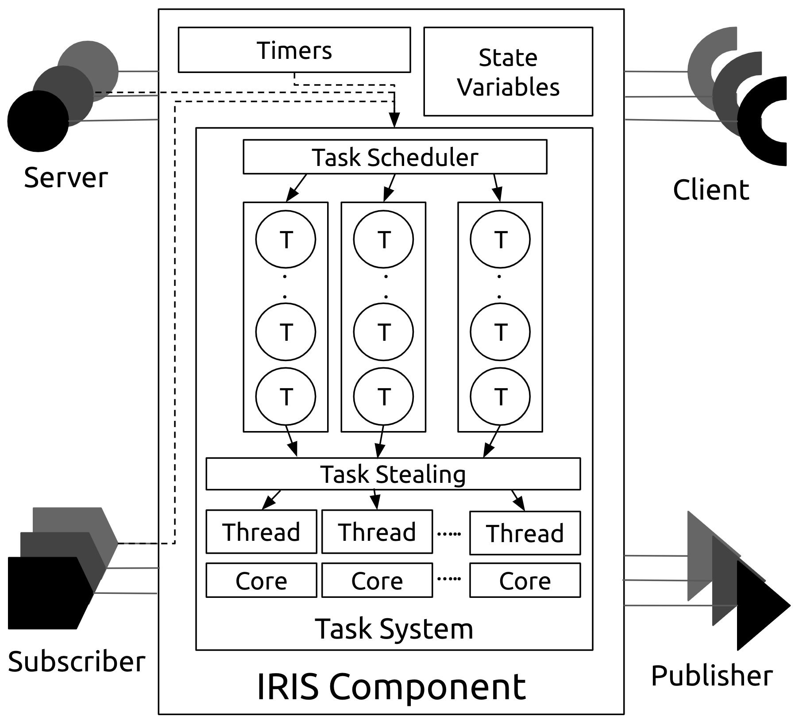

<p align="center">
    
</p>

`iris` is a `C++17` header-only library that provides a [component model](https://en.wikipedia.org/wiki/Component-based_software_engineering) and messaging framework based on [ZeroMQ](https://zeromq.org/). 

Here's a simple publish-subscribe example:

```cpp
// publisher.cpp
#include <iostream>
#include <iris/iris.hpp>

int main() {
  iris::Component sender;
  auto p = sender.create_publisher(endpoints = {"tcp://*:5555"});

  unsigned i{0};
  sender.set_interval(period = 500, 
                      on_expiry = [&] { 
                          const auto msg = "Hello World " + std::to_string(i);
                          p.send(msg);
                          std::cout << "Published " << msg << "\n";
                          ++i;
                      });
  sender.start();
}
```


```cpp
// subscriber.cpp
#include <iostream>
#include <iris/iris.hpp>

int main() {
  iris::Component receiver(threads = 2);
  receiver.create_subscriber(endpoints = {"tcp://localhost:5555"},
                             on_receive = [&](iris::Message msg) {
                                 std::cout << "Received "
                                           << msg.deserialize<std::string>()
                                           << "\n";
                             });
  receiver.start();
}
```

## Component Model

Here's the anatomy of an `iris::Component`. `iris` components can have a variety of ports and timers. There are 4 basic types of ports: ***publisher***, ***subscriber***, ***client***, and ***server*** ports. Publisher ports publish messages, without blocking, on specific endpoints. Subscriber ports subscribe to such topics (on specific endpoints) and receive messages published by one or more publishers. Server ports provide an interface to a component service. Client ports can use this interface to request such services. Component timers can be periodic or sporadic and allow components to trigger themselves with the specified timing characteristics.

An _operation_ is an abstraction for the different tasks undertaken by a component.  These tasks are implemented by the component’s source code written by the developer. Application developers provide the functional, business-logic code that implements operations on local state variables and inputs received on component ports. 

Operation requests (e.g., timer expired so please call my callback) are serviced by one or more executor threads that make up the component's task system. 

<p align="center">
    
</p>

## Quick Start

Simply include `#include <iris/iris.hpp>` and you're good to go. Start by creating an `iris::Component`:

```cpp
iris::Component my_component;
```

You can optionally specify the number of threads the component can use in its task system, e.g., this component will spawn 2 executor threads that processes records in its message queues. 

```cpp
iris::Component my_component(threads = 2);
```

### Periodic Timers

`iris` components can be triggered periodically by timers. To create a timer, call `component.set_interval`. The following component is triggered every 500ms. Timers are an excellent way to kickstart a communication pattern, e.g., publish messages periodically to multiple sinks.

```cpp
my_component.set_interval(500, [] { std::cout << "Timer fired!\n"; });
```

`iris` uses [NamedTypes](https://github.com/joboccara/NamedType) to provide named parameters. If you like being explicit, you can create this timer like so:

```cpp
my_component.set_interval(period = 500,
                          on_expiry = [] { std::cout << "Timer fired!\n"; });
```
