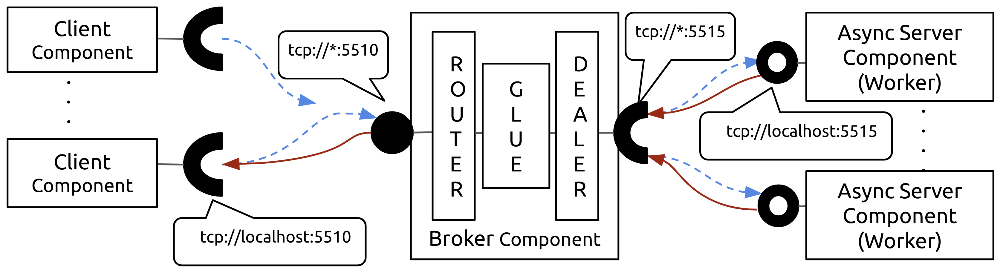

<p align="center">
    
</p>

`iris` is a `C++17` header-only library that provides a [component model](https://en.wikipedia.org/wiki/Component-based_software_engineering) and messaging framework based on [ZeroMQ](https://zeromq.org/). 

## Component Model

Here's the anatomy of an `iris::Component`. `iris` components can have a variety of ports and timers. There are 4 basic types of ports: ***publisher***, ***subscriber***, ***client***, and ***server*** ports. Publisher ports publish messages, without blocking, on specific endpoints. Subscriber ports subscribe to such topics (on specific endpoints) and receive messages published by one or more publishers. Server ports provide an interface to a component service. Client ports can use this interface to request such services. Component timers can be periodic or oneshot and allow components to trigger themselves with the specified timing characteristics.

An _operation_ is an abstraction for the different tasks undertaken by a component.  These tasks are implemented by the component’s source code written by the developer. Application developers provide the functional, business-logic code that implements operations on local state variables and inputs received on component ports. 

Operation requests (e.g., timer expired so please call my callback) are serviced by one or more executor threads that make up the component's task system. 

<p align="center">
    
</p>

## Getting Started

Simply include `#include <iris/iris.hpp>` and you're good to go. Start by creating an `iris::Component`:

```cpp
iris::Component my_component;
```

You can optionally specify the number of threads the component can use in its task system, e.g., this component will spawn 2 executor threads that process records in its message queues. 

```cpp
iris::Component my_component(iris::threads = 2);
```

**NOTE:** Here `iris::threads` is a [NamedType](https://github.com/joboccara/NamedType) parameter. It is not necessary to use named parameters but in certain cases, they improve code readability, e.g.,:

```cpp
using namespace iris;
// Works but not very readable:
// component.create_subscriber(std::vector<std::string>{"tcp://localhost:5555"}, 
//                             5000, 
//                             [] (Message msg) {});

// More readable:
component.create_subscriber(endpoints = {"tcp://localhost:5555"},
                            timeout = 5000,
                            on_receive = [] (Message msg) {}
                            );

```

## Time-Triggered Operations

`iris` components can be triggered periodically by timers. To create a timer, call `component.set_interval`. The following component is triggered every 500ms. Timers are an excellent way to kickstart a communication pattern, e.g., publish messages periodically to multiple sinks.

Call `Component.start()` to start the component - This starts the component executor threads, listener threads, timers etc.

```cpp
#include <iostream>
#include <iris/iris.hpp>
using namespace iris;

int main() {
  Component my_component;
  my_component.set_interval(period = 500,
                            on_triggered = [] { std::cout << "Timer fired!\n"; });
  my_component.start();
}
```

### One-shot Timers

Use `component.set_timeout` to create a one-shit timer that triggers the component after a set delay. 

```cpp
// oneshot_timers.cpp
#include <iris/iris.hpp>
using namespace iris;
#include <iostream>

int main() {
  Component c;
  c.set_timeout(delay = 1000,
                on_triggered = [] { std::cout << "1.0 second Timeout!" << std::endl; 
                });
  c.set_timeout(delay = 2500,
                on_triggered = [] { std::cout << "2.5 second Timeout!" << std::endl; 
                });
  c.set_timeout(delay = 5000, 
                on_triggered = [&] {
                    std::cout << "Stopping component" << std::endl;
                    c.stop();
                });
  c.start();
}
```

Noice that the component is stopped after 5 seconds - `component.stop()` stops the task scheduler from further processing of tasks. 

## Publish-Subscribe Interactions

Here's a simple publish-subscribe example. 

Let's say we want to periodically publish `Mouse` position and our struct looks like this: 

```cpp
struct Mouse {
  int x, y;
};
```

`iris` uses [Cereal](https://github.com/USCiLab/cereal) library for serialization and deserialization of user-defined structures. To enable serialization of `Mouse` objects, write a save method like below:

```cpp
struct Mouse {
  int x, y;

  // Method for serialization
  template <typename Archive>
  void save(Archive& ar) const {
    ar(x, y);
  }
};
```

Now we can create an `iris::Publisher` using `component.create_publisher`. Publish periodically by creating a timer and publishing mouse objects using `publisher.send`.

```cpp
// publisher.cpp
#include <iostream>
#include <random>
#include <iris/iris.hpp>
using namespace iris;

struct Mouse {
  int x, y;

  // Method for serialization
  template <typename Archive>
  void save(Archive& ar) const {
    ar(x, y);
  }
};

int main() {
  std::random_device rd; // obtain a random number from hardware
  std::mt19937 eng(rd()); // seed the generator
  std::uniform_int_distribution<> x_dist(0, 1920); // random number generator for Mouse X position
  std::uniform_int_distribution<> y_dist(0, 1080); // random number generator for Mouse Y position

  Component sender;
  auto p = sender.create_publisher(endpoints = {"tcp://*:5555"});

  sender.set_interval(period = 250, 
    on_triggered = [&] { 
        Mouse position {.x = x_dist(eng), .y = y_dist(eng)};
        // Publish the position
        p.send(position);
        std::cout << "Published (" << position.x << ", " << position.y << ")\n";
  });
  sender.start();
}
```

Now let's write a `recevier` component. Define the `Mouse` struct and write a `load` method to enable deserialization. 

Create an `iris::Subscriber` using `component.create_subscriber`. Subscribers are implemented using ZeroMQ. The timeout parameter sets the timeout (in milliseconds) for the receive operation on the socket. If the value is 0, `recv()` will return immediately and loop until a message is received. If the value is -1, it will block until a message is available. For all other values, it will wait for a message for that amount of time before trying again. 

Subscriber callbacks have the signature `std::function<void(iris::Message)>`, i.e., subscriber receives `iris::Message` objects in its callback. Simply call `messsage.get<T>` to deserialize to the type `T`. 

```cpp
// subscriber.cpp
#include <iostream>
#include <iris/iris.hpp>
using namespace iris;

struct Mouse {
  int x, y;

  // Method for deserialization
  template <typename Archive>
  void load(Archive& ar) {
    ar(x, y);
  }
};

int main() {
  Component receiver(threads = 2);
  receiver.create_subscriber(endpoints = {"tcp://localhost:5555"},
    timeout = 100, // timeout after 100ms and check again
    on_receive = [](Message msg) {
      auto position = msg.get<Mouse>();
      std::cout << "Received (" << position.x << ", " << position.y << ")\n";
  });
  receiver.start();
}
```

## Synchronous Request-Reply Interactions

The client-server model is one of the basic interaction patterns in `iris` - client sends a request and server replies to the request.

<p align="center">
    
</p>

Say we have a music database server that can be queried for album metadata. Clients can request for album metadata using a catalog ID. Servers will respond with the album metadata. 

Let's start with the server response - the `Album` struct. Note the use of cereal `serialize` method for serialization/deserialization.

```cpp
// album.hpp
#pragma once
#include <iris/cereal/types/vector.hpp>
#include <string>
#include <vector>

struct Album {
  std::string name;
  std::string artist;
  int year;
  std::string genre;
  std::vector<std::string> tracks;

  template <class Archive> void serialize(Archive &ar) {
    ar(name, artist, year, genre, tracks);
  }
};
```

To create a server port, call `component.create_server`. 

* Server callbacks have the signature `std::function<void(Request, Response&)>`
* Simply deserialize the request, perform the server task, and use `response.set()` to set the server response

```cpp
// server.cpp
#include "album.hpp"
#include <iris/iris.hpp>
using namespace iris;
#include <iostream>
#include <map>

int main() {

  // This is our "database"
  std::map<std::string, Album> albums;
  albums["R2 552927"] = Album{
      .name = "Paranoid",
      .artist = "Black Sabbath",
      .year = 1970,
      .genre = "Heavy metal",
      .tracks = {"War Pigs", "Paranoid", "Planet Caravan", "Iron Man",
                 "Electric Funeral", "Hand of Doom",
                 "Jack the Stripper / Fairies Wear Boots"}};

  // Server component
  Component music_tag_component;
  music_tag_component.create_server(
      endpoints = {"tcp://*:5510"}, 
      timeout = 500,
      on_request = [&](Request request, Response &response) {
          auto catalog_id = request.get<std::string>();
          std::cout << "Received request for catalog # " << catalog_id << "\n";
          response.set(albums[catalog_id]);
      });
  music_tag_component.start();
}
```

Now, we can write a client that calls this server. Create a client port using `component.create_client`. `iris` clients implement the [lazy pirate](http://zguide.zeromq.org/php:chapter4#Client-Side-Reliability-Lazy-Pirate-Pattern) pattern - Rather than doing a blocking receive, `iris` clients:

* Send a request to the server
* Poll the REQ socket and receive from it only when it's sure a reply has arrived.
* Resend a request, if no reply has arrived within a timeout period.
* Abandon the transaction if there is still no reply after several requests.


```cpp
// client.cpp
#include "album.hpp"
#include <iostream>
#include <iris/iris.hpp>
using namespace iris;

int main() {
  Component c(threads = 1);
  c.start();
  auto client = c.create_client(endpoints = {"tcp://127.0.0.1:5510"},
                                timeout = 2500, 
                                retries = 3);
                                
  std::string request = "R2 552927";
  std::cout << "Sending request with catalog# " << request << std::endl;
  
  // Client-server call
  auto response = client.send(request);
  
  // Parse server response
  auto album = response.get<Album>();
  std::cout << "- Received album:\n";
  std::cout << "    Name: " << album.name << "\n";
  std::cout << "    Artist: " << album.artist << "\n";
  std::cout << "    Year: " << album.year << "\n";
  std::cout << "    Genre: " << album.genre << "\n";
  std::cout << "    Tracks:\n";
  for (size_t i = 0; i < album.tracks.size(); ++i) {
    std::cout << "      " << i << ". " << album.tracks[i] << "\n";
  }
  c.stop();
}
```

## Asynchronous Request-Reply Interactions

<p align="center">
    
</p>
